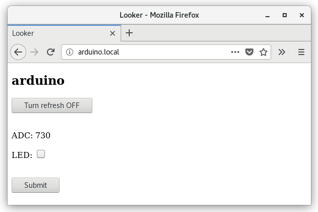

# Looker
## Overview
Looker is an Open Source, multi-platform solution for making existing or new embedded projects wireless. Currently Looker supports only WiFi but Bluetooth is planned to be added in the future.

The main goal of this project is to make it easy to use with maximum portability. Thanks to simple API Looker is installed by just adding a few lines of code. For a network communication it useses ESP8266 - popular and readily available WiFi module which is connected to the main board with only four wires.

The system is successfully ported to broad range of Arduino, ARM and PC projects. It is written in C so it can be further ported to any platform where C compiler is available.

Looker is divided into two parts:

1. [HTTP server](src/looker_slave) running on ESP8266
2. [Library](src/looker_master) to be imported to a custom project

Looker library and HTTP server are synchronized over a serial port.

Any device with a web-browser installed: PC, smart phone, tablet can be used to control Looker-powered device. No additional application is necessary.

## How does it work
HTTP server dynamically creates a simple website that lists out some variables from the user's code. Only variables explicitly registered to Looker database will be showed on the website. Within the code those variables can be linked to an external sensors, relays, LEDs etc. From the website you can read/write the variables and see instant effect from/on the embedded device e.g. turn a LED, switch a relay, read temperature from a temp. sensor and so on.

## Where can it be used
1. Looker adds a smart and convenient user interface (UI) feature to an embedded project where often this thing is very limited. Instead of connecting a display with bunch of cables, some extra LEDs for output or buttons for input user can have this all conveniently on a remote device e.g. a tablet already equipped with high-res display. If UI requires more I/O they can be simply added in a software rather than in hardware.

2. Not only does Looker let a user control the device from local network but also from the outside World as long as the device’s IP is accessible.

3. Remote debugging. Being able to view and modify variables on fly can make debugging easier specially when a specialized debugger is not available. 

## Licensing
Looker is released under **[MIT](LICENSE)** open source license.

## Hello World
### This is a simple Arduino [app](src/examples/arduino/helloWorld/helloWorld.ino) to read ADC and drive LED from a website:

```C
#include "looker_master.h"
#include "looker_stubs.h"
#include "wifi.h"

#define LOOKER_DOMAIN "arduino"

volatile unsigned int adc;
volatile unsigned char led = 0;

void setup() {
    pinMode(LED_BUILTIN, OUTPUT);
    digitalWrite(LED_BUILTIN, 1);
    serial_init();

    looker_connect(LOOKER_SSID, LOOKER_PASS, LOOKER_DOMAIN);
    looker_reg("ADC", &adc, sizeof(adc), LOOKER_TYPE_UINT, LOOKER_LABEL_VIEW, NULL);
    looker_reg("LED", &led, sizeof(led), LOOKER_TYPE_UINT, LOOKER_LABEL_CHECKBOX, NULL);
}

void loop() {
    adc = analogRead(A0);
    digitalWrite(LED_BUILTIN, led);
    looker_update();
}
```
### The device is now accessible at address: http://arduino.local


**.local** is added to the domain by multicast Domain Name System (mDNS) that Looker is using.

## API walkthrough
---
```C
looker_exit_t looker_connect(const char *ssid, const char *pass, const char *domain)
```
Connects to the WiFi network. Usually it takes a couple of seconds to complete.
Blue LED on the WiFi module stops blinking when it gets connected.  
details:  
**looker_exit_t**  
type of exit code. On success the function returns: LOOKER_EXIT_SUCCESS. Full definition is available in *looker.h*

**ssid  
pass**  
credentials to the WiFi network.
It is better to define it outside of the main source code e.g. in *wifi.h*.
In this case you don’t reveal it when sharing the code. Also helps organize when multiple networks are available.  
Example of *wifi.h*:

```C
//network 1
#define LOOKER_SSID "ssid1"
#define LOOKER_PASS "pass1"

//network 2
//#define LOOKER_SSID "ssid2"
//#define LOOKER_PASS "pass2"
```
**domain**  
sets domain name at which the device advertises. Using domain helps finding the device but is not necessary. If **domain** is skipped:
```C
looker_connect(LOOKER_SSID, LOOKER_PASS, NULL)
```

device is still present at IP address that was assigned by the access point.
Tool like “Fing” might be helpful in finding this IP address.

---
```C
looker_exit_t looker_reg(const char *name, volatile void *addr, int size, looker_type_t type, looker_label_t label, STYLE_TYPE style)
```
Registers the variable making it accessible from the website.

**name**  
variable will be showed under this name on the website. The name does not need to be the same as the C variable.
Max size of this name (string) is limited in *looker_master.h* and *looker_slave.h*:
```C
#define LOOKER_MASTER_VAR_NAME_SIZE 16
#define LOOKER_SLAVE_VAR_NAME_SIZE 16
```
**addr**  
address of the variable

**size**  
size of the variable

**type**  
type of the variable. Looker needs to know what kind of variable it is. Following types are supported:  
  
*LOOKER_TYPE_INT*  
all signed integers: char, short, int, long int  

*LOOKER_TYPE_UINT*  
all unsigned integers  

*LOOKER_TYPE_FLOAT*  
float and double  

*LOOKER_TYPE_STRING*  
string

The following parameters specify the number of digits after the decimal place to print:  
*LOOKER_TYPE_FLOAT_0*  
*LOOKER_TYPE_FLOAT_1*  
*LOOKER_TYPE_FLOAT_2*  
*LOOKER_TYPE_FLOAT_3*  
*LOOKER_TYPE_FLOAT_4*  
default number is defined in *looker.h*:
```C
#define LOOKER_TYPE_FLOAT LOOKER_TYPE_FLOAT_1
```

The above apply to both float and double.  
All variables except string can have size of up to 8 bytes (64-bit).
Maximum size – including string is limited in *looker_master.h* and *looker_slave.h*:
```C
#define LOOKER_MASTER_VAR_VALUE_SIZE 16
#define LOOKER_SLAVE_VAR_VALUE_SIZE 16
```
**label**  
specifies how the variable is presented on the website. Following variants are supported:  

*LOOKER_LABEL_CHECKBOX*  
checkbox, suitable for bool (TRUE/FALSE) variables  

*LOOKER_LABEL_CHECKBOX_INV*  
same as above but with inverted state.This is useful if the checkbox controls a LED. Depending on LED polarity having normal and inverted state allows to always have: checked – LED on, unchecked – LED off  

*LOOKER_LABEL_VIEW*  
variable is read only  

*LOOKER_LABEL_EDIT*  
variable can be edited

**style**  
CSS enhances viewing experience.

Example:
```C
#define STYLE "color:red;"	//red text
```
Style can be disabled, fixed or variable:  
*LOOKER_STYLE_DISABLED*  
no CSS is used  

*LOOKER_STYLE_FIXED*  
style is fixed and cannot be changed  

*LOOKER_STYLE_VARIABLE*  
style can be changed on fly but this requires more RAM.  

The following selects the style for master (*looker_master.h*) and slave (*looker_slave.h*)
```C
#define LOOKER_MASTER_STYLE LOOKER_STYLE_VARIABLE
#define LOOKER_SLAVE_STYLE LOOKER_STYLE_VARIABLE
```

Max size of style (string) is limited in *looker_common.h*:
```C
#define LOOKER_VAR_STYLE_SIZE 48
```

For more info refer to Arduino app [style](src/examples/arduino/style/style.ino)

---
```C
looker_exit_t looker_update(void)
```
Synchronizes all registered variables with the web server.
If a variable changes locally looker_update changes it also on the website and the other way around.
If same variable changes at the same time on both sides the website takes precedence (human wins over computer).

*looker_update* should be placed in main loop.
The more frequent it is called the more often the variables get updated.


## Fine-tuning
*looker_common.h*, *looker_master.h* and *looker_slave.h* have some defines that help optimize Looker:
```C
#define LOOKER_MASTER_USE_MALLOC
#define LOOKER_SLAVE_USE_MALLOC
```
Each variable needs a block of data that defines this variable.
This data can be allocated statically or dynamically.
If the line is commented out static data is preferred.

LOOKER_MASTER_VAR_COUNT/LOOKER_SLAVE_VAR_COUNT limits number of blocks of data to be allocated but with static they are all used. Therefore this value should be equal to the number of variables intended to use otherwise extra RAM will be wasted. With dynamic data block is allocated per variable (still up to LOOKER_MASTER_VAR_COUNT/LOOKER_SLAVE_VAR_COUNT) so RAM is better utilized. The trade off is that malloc function itself takes some space specially if it is not used elsewhere and it gets linked specially for Looker. Also data for static variables are guaranteed at the compilation time whereas dynamic data only during run time. Depending on resources, other prior malloc usage it might be possible that there will not be enough memory for Looker to allocate. 
```C
#define LOOKER_MASTER_SANITY_TEST
#define LOOKER_SLAVE_SANITY_TEST
```
This turns on a simple test that checks if a function parameter or a variable exceeds its range. This feature can be disabled to get smaller code footprint. 
